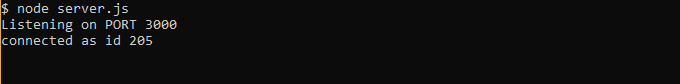

# Burger
GW Homework #14 

This application demonstrates a simple full stack application with a front end implemented with HTML/CSS and elements from the Materialize framework and the backend implemented with Node.js and Express. HTML templating is done with the help of Handlebars.

The user may enter any burger name to add it to the menu. This also adds the new burger entry into the MySQL database. The initial burger entry is added as available on the menu and placed on the left side of the screen. The user may then eat any burger by clicking on it, which moves it into the adjacent column and updates its status accordingly in the database.

<h2>Demo</h2>
<i>Eat Da Burger</i> is deployed to Heroku. Please check it out <a href="https://monster-burger.herokuapp.com/">here</a>.

<h2>Installation</h2>
To install the application follow the instructions below:

<ol>
    <li>git clone git@github.com:valfragier16/Burger.git</li>
    <li>cd Burger</li>
    <li>npm install</li>
</ol>

<h2>Run Locally</h2>
Once you have completed installation, to access the application in your browser, first run <i>node server.js</i> in your terminal within the <i>Burger</i> folder.

If done properly, your terminmal should display the following:

Now, open the local application on port 3000 at the URL: <i>http://localhost:3000/</i>.
